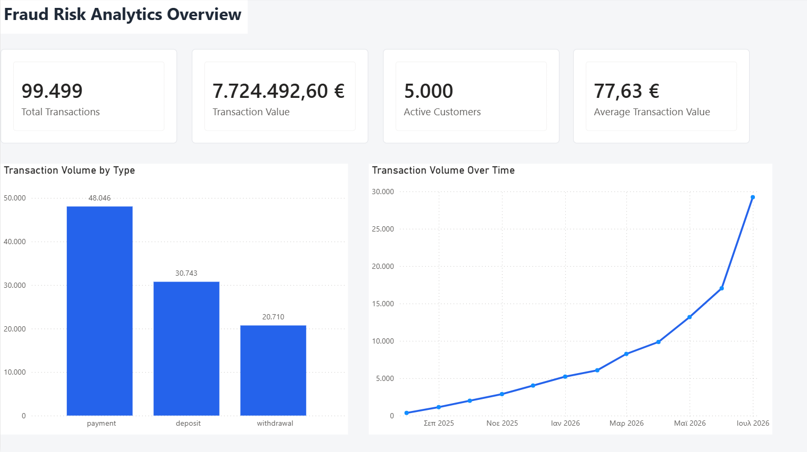
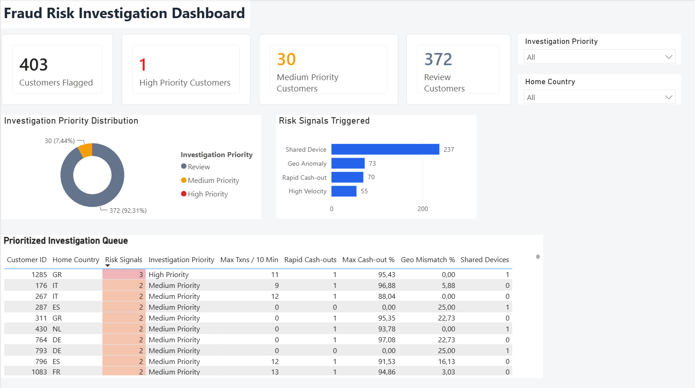

# Fraud Risk Analytics

Analysis of 99,499 synthetic payment transactions using **PostgreSQL and Power BI**.

The project explores four fraud risk signals — shared devices, geographic mismatches, high transaction velocity and rapid cash-out — and combines them into a customer-level investigation score.

## Dashboard

### Overview

### Risk Investigation

[Power BI file](powerbi/Fraud_Risk_Analytics.pbix)

## Results

- 99,499 transactions
- €7.72M transaction value
- 5,000 customers
- 403 customers matched at least one risk signal
- 31 customers classified as Medium or High Priority

Signal counts:

- Shared Device — 237
- Geo Anomaly — 73
- Rapid Cash-out — 70
- High Velocity — 55

## Tools

**PostgreSQL · SQL · Power BI · DAX · Power Query**

SQL techniques include CTEs, window functions, joins, aggregations and self-joins.

## Files

- `sql/01_schema.sql` — database schema
- `sql/02_exploratory_analysis.sql` — transaction analysis
- `sql/03_risk_indicators.sql` — individual risk signals
- `sql/04_investigation_scoring.sql` — combined scoring
- `powerbi/Fraud_Risk_Analytics.pbix` — Power BI report

> All data is synthetic. Risk signals indicate patterns for review and do not represent confirmed fraud.
